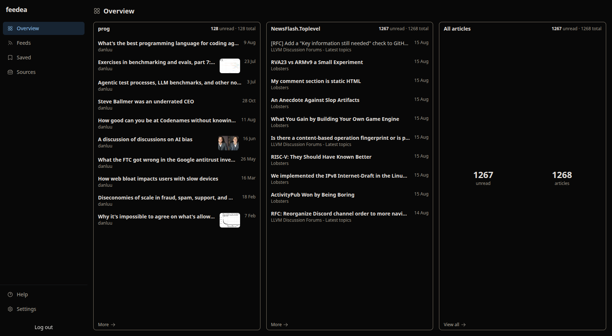
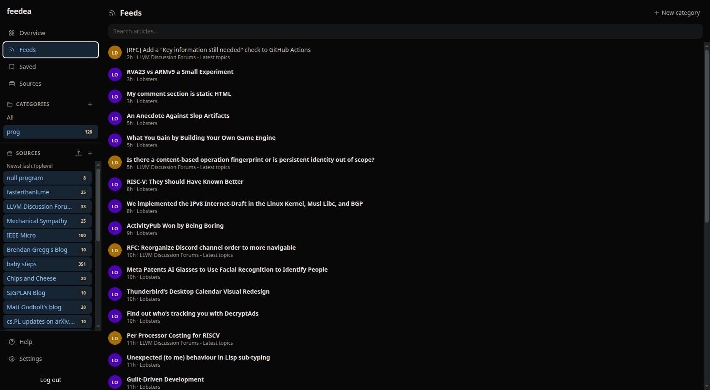
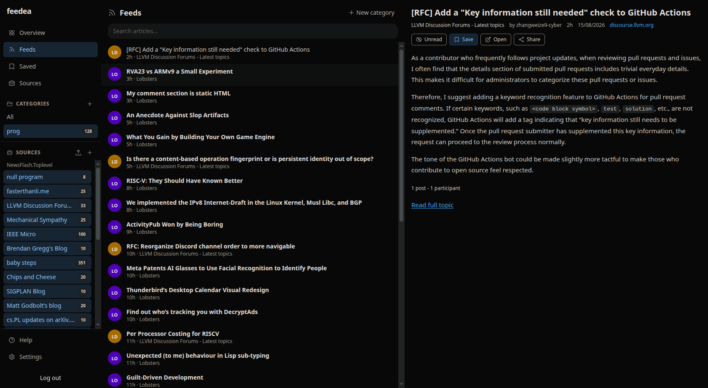
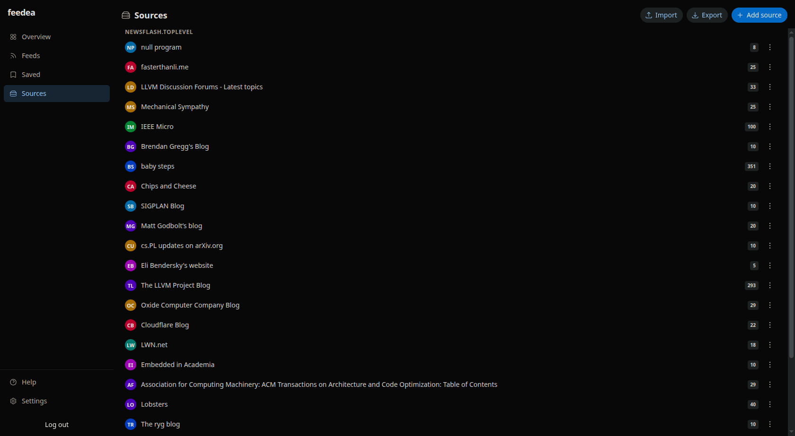
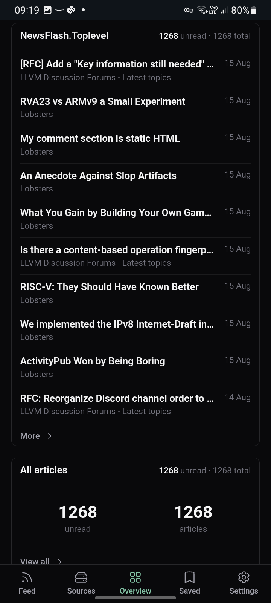
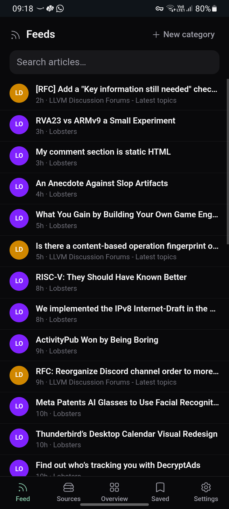
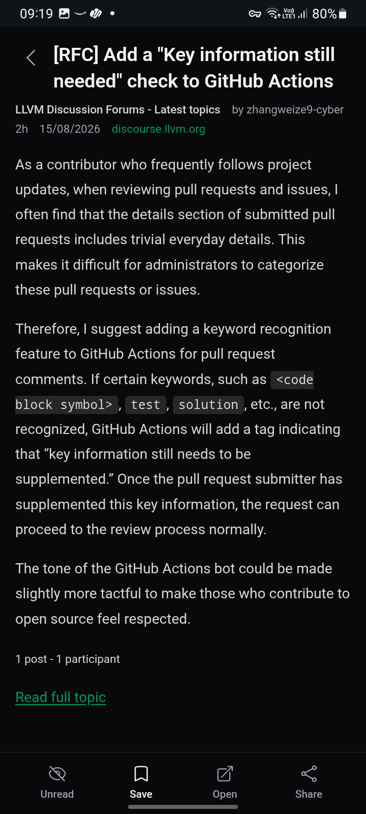
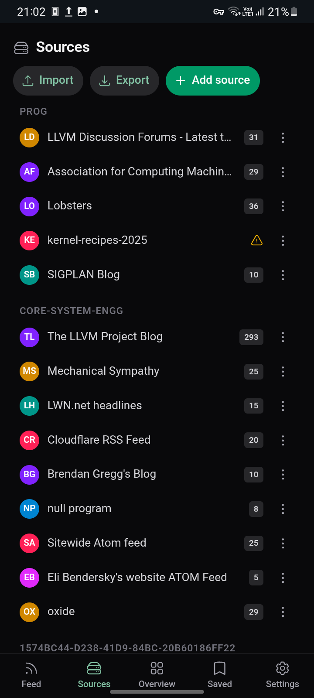

# Feedea

[](https://github.com/80avin/feedea/actions/workflows/ci.yml)
[](https://github.com/80avin/feedea/actions/workflows/release.yml)

A self-hosted RSS feed aggregator with a built-in web UI.

Single Rust binary, embedded React frontend, SQLite storage. Built on the
[news-flash](https://crates.io/crates/news-flash) engine.

## Features

- Feed management: add, discover, import/export OPML, per-feed refresh
- Articles: list, search, save with notes and tags, mark read/unread
- Categories and unread badges
- Privacy-friendly image proxy (private-network proxying off by default)
- PWA: installable, works offline after first load

## Screenshots

### Desktop

<table>
  <tr>
    <td align="center"><br/>Overview</td>
    <td align="center"><br/>Feeds</td>
    <td align="center"><br/>Reader</td>
    <td align="center"><br/>Sources</td>
  </tr>
</table>

### Mobile

<table>
  <tr>
    <td align="center"><br/>Overview</td>
    <td align="center"><br/>Feeds</td>
    <td align="center"><br/>Reader</td>
    <td align="center"><br/>Sources</td>
  </tr>
</table>

## Requirements

- Rust toolchain (stable) + `cargo`
- [bun](https://bun.sh) for the frontend (used for both dev and build)

### Build dependencies (system libraries)

The build links against a few system libraries (via the news-flash engine and
reqwest). You need these installed before `cargo build`:

- **pkg-config** — build-time dependency probe
- **OpenSSL headers** (`libssl-dev`) — Linux/macOS only (Windows uses SChannel)
- **libxml2 headers** (`libxml2-dev`) — from the `libxml` crate (news-flash's
  article scraper)
- **libclang** (`libclang-dev`) — required by `bindgen`, which the `libxml`
  crate runs at build time

Install per platform:

```sh
# Debian / Ubuntu
sudo apt-get install -y pkg-config libssl-dev libxml2-dev libclang-dev

# macOS (Homebrew)
brew install pkg-config openssl libxml2
# libclang is provided by the Xcode Command Line Tools (xcode-select --install)

# Windows (vcpkg) — then set the env vars below
vcpkg install libxml2 --triplet x64-windows-static-md
set VCPKGRS_TRIPLET=x64-windows-static-md
set LIBCLANG_PATH=C:\Program Files\LLVM\bin
set VCPKG_ROOT=C:\vcpkg
```

On macOS, brew's libxml2 is keg-only, so also export its pkg-config path before
building:

```sh
export PKG_CONFIG_PATH="$(brew --prefix libxml2)/lib/pkgconfig"
```

If bun is not on your PATH (e.g. installed via the bun installer into


`~/.bun/bin`), add it:

```sh
export PATH="$HOME/.bun/bin:$PATH"
```

## Quick start (production binary)

```sh
make build        # builds frontend then cargo build --release
./target/release/feedea --data-dir /path/to/data
```

On first run feedea prints a generated password to stderr. Log in at the web
UI and change it in Settings.

Default data dir (when `--data-dir` is omitted):
`$HOME/.local/share/feedea` (or `FEEDEA_DATA_DIR`).

## Development

Run backend and frontend together:

```sh
make dev
```

- backend: `cargo run` on port 3000
- frontend: `bun run dev` (Vite) on port 5173, proxying `/api` and `/img` to
  the backend

Or run them in two terminals:

```sh
# terminal 1 — backend
make backend-dev

# terminal 2 — frontend
make frontend-dev
```

Then open http://localhost:5173.

### Tests

```sh
make test     # cargo test + frontend typecheck/lint
```

### Other targets

| target           | purpose                                            |
| ---------------- | -------------------------------------------------- |
| `make build`     | `bun run build` then `cargo build --release`       |
| `make run`       | `cargo run --release` (single binary)              |
| `make dev`       | backend + Vite concurrently                        |
| `make test`      | cargo tests + frontend typecheck/lint              |
| `make clean`     | remove `target/`, `frontend/dist`, `frontend/node_modules` |

## Configuration

The binary accepts these flags; each can also be set as an environment
variable:

| flag                      | env                         | default                     | description                        |
| ------------------------- | --------------------------- | --------------------------- | ---------------------------------- |
| `--data-dir`              | `FEEDEA_DATA_DIR`            | `~/.local/share/feedea`      | data directory                     |
| `--host`                  | `FEEDEA_HOST`                | `0.0.0.0`                   | listen address                     |
| `--port`                  | `FEEDEA_PORT`                | `3000`                      | listen port                        |
| `--allow-private-proxy`   | `FEEDEA_ALLOW_PRIVATE_PROXY` | `false`                     | allow proxying images from private networks |

Example:

```sh
FEEDEA_PORT=8080 FEEDEA_ALLOW_PRIVATE_PROXY=1 ./target/release/feedea
```

### Data directory layout

```
<data_dir>/
  feedea.sqlite              # feedea settings, sessions
  feedea.sqlite-wal, -shm    # SQLite WAL files
  engine/
    config/                 # news-flash config
    data/
      database.sqlite       # news-flash feed/article database
```

Back up the whole `<data_dir>` for a full snapshot.

## Self-hosting

See [docs/selfhosting.md](docs/selfhosting.md) for the systemd unit,
deployment notes, and troubleshooting.

## License

feedea links against [news-flash](https://crates.io/crates/news-flash), which
is licensed GPL-3.0-or-later. The combined binary is therefore distributed
under GPL-3.0-or-later — provide the corresponding source if you distribute
the binary. See `Cargo.lock` for the full dependency tree and licenses.
